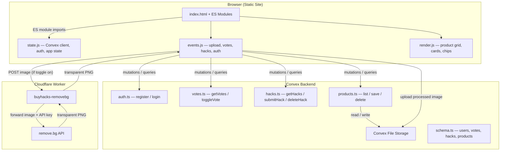
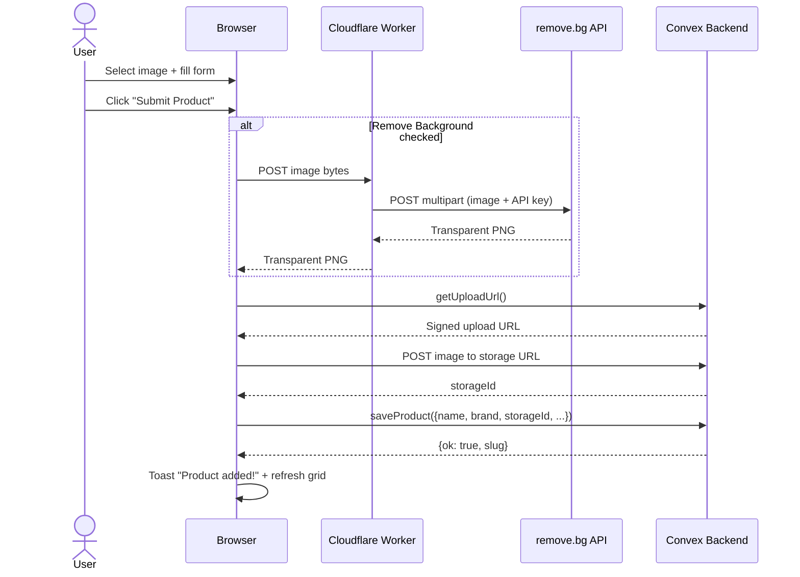

# BuyHacks

Curated product showcase with community votes and life-hack tips.

**Live:** [buyhacks.neorgon.com](https://buyhacks.neorgon.com/)

## Features

- 24 curated products across 7 categories
- Vote love / own / want on any product (anonymous, visitor-ID dedup)
- Submit life-hack tips (login required, 280 char limit, max 3 per product)
- Search, category filter chips, sort by most loved/owned/wanted
- User auth (register/login) with admin roles
- User-submitted products with image upload
- Automatic background removal via Cloudflare Worker + remove.bg

## Architecture



## Image Upload Flow



## Stack

- Static HTML + ES modules (no build step)
- CSS glassmorphism cards with amber `#f59e0b` accent
- [Convex](https://convex.dev/) serverless backend (votes, hacks, auth, products, file storage)
- [Cloudflare Workers](https://workers.cloudflare.com/) for remove.bg proxy
- Images hosted at `minibooks.lucianoadonis.com` (static) + Convex storage (user uploads)

## Run locally

```bash
npm install                # install Convex SDK
npx convex dev             # start Convex backend
python3 -m http.server 8777  # serve frontend
```

Open `http://localhost:8777`.

### Cloudflare Worker (optional, for background removal)

```bash
cd worker
npm install
npx wrangler secret put REMOVEBG_API_KEY   # paste your remove.bg API key
npx wrangler dev                            # local dev
npx wrangler deploy                         # deploy to Cloudflare
```

## Project structure

```
buyhacks-site/
  index.html              # HTML shell
  css/style.css           # All styles
  js/
    app.js                # Entry point
    state.js              # Convex client, auth, worker URL, mutable state
    data.js               # 24 products, categories, verdict labels
    render.js             # DOM rendering (grid, chips, cards)
    events.js             # Event handlers (votes, hacks, auth, upload)
    utils.js              # escHtml, toast, debounce, timeAgo
  convex/
    schema.ts             # users, votes, hacks, products tables
    auth.ts               # register / login mutations
    votes.ts              # getVotes query, toggleVote mutation
    hacks.ts              # getHacks query, submitHack / deleteHack mutations
    products.ts           # list query, save / delete / getUploadUrl mutations
  worker/
    src/index.js          # Cloudflare Worker — remove.bg proxy
    wrangler.toml         # Worker config (allowed origins, secrets)
    package.json          # wrangler devDependency
```
